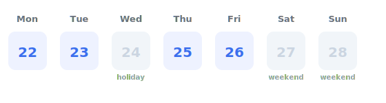

## An order lands on a Wednesday before Thanksgiving

You promise "ships in 2 business days." Add two calendar days and you'll tell the
customer Friday — except Thursday is Thanksgiving and Friday is a company holiday,
so the honest answer is the following Monday. Getting that right normally means a
holidays table you maintain by hand, per country, forever.

`vgi-calendar` attaches to DuckDB and knows the holidays already. `add_business_days`
is a scalar, so the correct due date is one function call:

```sql {role=step expect=scalar}
SELECT cal.main.add_business_days(DATE '2026-11-25', 2) AS due_date;
```
```result
due_date
2026-11-30
```

Wednesday the 25th + 2 working days lands on Monday the 30th — Thursday's holiday
and the weekend are skipped for you.



## The same call, across a whole orders table

Scalars vectorize, so the promise date for an entire table is one projection —
no per-row loop, no join to a calendar dimension.

```sql {role=step expect=rows}
WITH orders(id, order_date) AS (
  VALUES (1, DATE '2026-11-25'), (2, DATE '2026-12-24'), (3, DATE '2026-07-02')
)
SELECT id, order_date, cal.main.add_business_days(order_date, 2) AS due_date
FROM orders
ORDER BY id;
```
```result
id    order_date    due_date
1     2026-11-25    2026-11-30
2     2026-12-24    2026-12-29
3     2026-07-02    2026-07-07
```

Order 3 is the tell: July 2 + 2 lands on July 7, because July 3 is observed for
Independence Day and the 4th–5th are the weekend.

## When someone disputes a date, show your work

`business_days_between` counts the gap, and `holidays` lists exactly which days
were excluded — the receipt for any due date you quoted.

```sql {role=step expect=rows}
SELECT date, name
FROM cal.main.holidays(2026, country := 'US')
WHERE date BETWEEN DATE '2026-11-24' AND DATE '2026-11-30'
ORDER BY date;
```
```result
date          name
2026-11-26    Thanksgiving Day
```

## The query to keep

For a table with an `order_date` column, this is the whole feature:

```sql {role=illustrative}
SELECT *, cal.main.add_business_days(order_date, 2) AS due_date FROM orders;
```

Trading desks want the [market-day version of exactly
this](trading-calendar-gotchas.html) — `add_trading_days`, `market_close`, and
`trading_schedule` do it for NYSE, LSE, and Tokyo sessions. The
[vgi-calendar reference](https://github.com/Query-farm/vgi-calendar) has the full
catalog.
